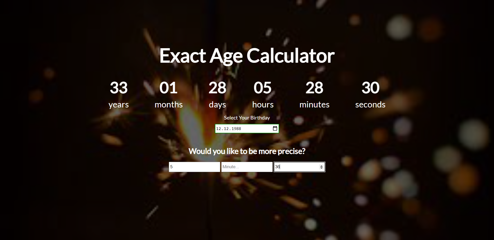

# Exact_Age_Calculator

## Overview

### The challenge

Users should be able to:

- View the optimal layout for the component depending on their device's screen size
- See hover states for all interactive elements on the page
- When entered a valid birth date, see their exact age with years, months, days, hours, minutes and seconds
- Hours, minutes and seconds are optional. If omitted, they're given default

### Screenshot

### Built with

- Semantic HTML5 markup
- CSS custom properties
- Flexbox
- Mobile-first workflow
- JavaScript

